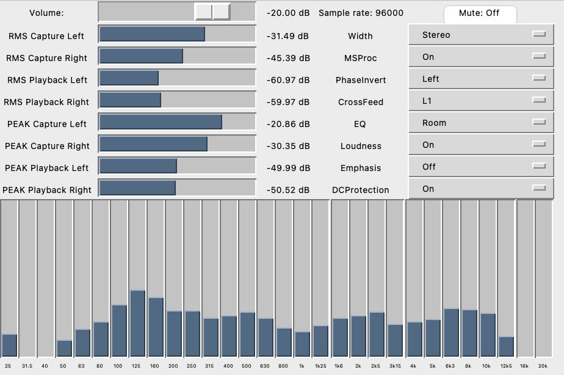

# CamillaDSP Monitor

A host monitor program for CamillaDSP, inspired by the RME ADI-2 DAC/Pro.

# Introduction

The [CamillaDSP](https://github.com/HEnquist/camilladsp/) project provides a seamless approach to do DSP system-wide on all major desktop operating systems, with various DSP features ready to be used, such as [Loudness](https://en.wikipedia.org/wiki/Loudness_compensation), [Convolution](https://en.wikipedia.org/wiki/Convolution), or [Parametric EQ](https://en.wikipedia.org/wiki/Equalization_(audio)#Parametric_equalizer).  It utilizes a setting file that can be sent to the [websocket](https://henquist.github.io/0.6.3/websocket.html) in run time. 

This program provides an easy interface to access various useful DSP features powered by CamillaDSP. Users can enable/disable complex DSP functionalities with just one or two key presses. It also displays a very useful spectrum analyzer in the terminal. The DSP workflow is heavily inspired by the [RME ADI-2 DAC](https://www.rme-audio.de/adi-2-dac.html).

# DSPs available

The project offers the following functionalities, and more can be added in the same way.

## Volume Control

Current volume setting is displayed on top of the screen.

## Status Monitor

The current sample rate, RMS and peak volume of both input and output channels are clearly displayed on the terminal

## Mute

The mute function will mute the audio output. Its status is shown right after the volume setting.

## Width

Define stereo width. Mono for mono, and Swapped have the channels swapped.

## M/S Proc

Activates M/S processing. Monaural content is sent to the left, stereo to the right channel.

## Phase Inversion

Some poorly mastered recordings have an inverted phase and the script can correct it.

## Crossfeed

The script offers 5 levels of headphone crossfeed based on my [CamillaDSP-Crossfeed](https://github.com/Wang-Yue/camilladsp-crossfeed/) project.

## EQ

The script provides EQ function for headphone and room correction.

## Loudness

The script offers the same Loudness feature as the RME ADI-2 DAC.

## Emphasis

In the early times of digital audio, pre- and de-emphasis were used for radio transmission. The audio signal is equalized to have treble boosted when recorded. When played back an analog treble filter is required. Many older CDs were recorded with Emphasis.

DAC chips, modern ones included, usually have a register to turn on de-emphasis but not many audio products use this feature. As a result, old CDs may feel too bright when playing via modern hardware. This project offers an identical solution implemented in software. Users may choose to pre-emphasis or de-emphasis the signal before sending it to the output.

## DC Protection

With the latest RME ADI-2 DAC/Pro firmware, a DC Protection filter is added to remove potentially harmful DC in the digital source signal. This project provides an identical implementation.

This filter adds a special, smooth high pass to the DA path, with zero latency, very low THD and phase deviation. This filter has a corner frequency of 7 Hz, to not only cancel DC but also reduce the amount of inaudible and imperceptible infrasound that plagues some sources.

## Spectrum analyzer

The Analyzer is modeled after RME’s ADI-2 DAC, which is based on the Spectral Analyzer in DIGICheck. 

It uses 29 biquad bandpass filters for high separation between the bands, providing outstanding musical visualization.
To be able to also show DC content the lowest band is not a band-pass filter, but a low pass, catching the whole range
from 0 Hz up to 30 Hz. With some unusual signals it therefore can happen that the level shown will be a bit higher than expected.

The shown frequency range is always the human audible range, 20 Hz up to 20 kHz.

As opposed to most other solutions no FFT (Fast Fourier Transform) is used. The Spectral
Analyzer performs a true band-pass filter calculation, as in professional hardware devices. The
frequency distance between the filters is scaled matching human hearing. 

The Spectrum Analyzer shows spectrum for both left and right channels. `%` symbol indicates level for the left channel and `@` for the right channel.

# User Interface

The script has a simple terminal user interface. When being executed, CamillaDSP is started automatically.

The `monitorgui.py` has a simple graphical user inter face.

Here's a video [demo](https://www.youtube.com/watch?v=OLZ43epCpHQ).

## Prerequisites

The program is written in Python 3. It also uses the [PyCamillaDSP](https://github.com/HEnquist/pycamilladsp/) library (currently requires the `next` branch).
So please install both before running this program.

## Setup

You need to edit the device section in `setting.yml` and `spectrum.yml` to use your loopback and playback devices.
Please refer the official CamillaDSP [documentation](https://henquist.github.io/0.6.3/) on how to set up your audio devices.

## Startup

Simply by invoking `./monitor.py` in the command line. That will give you the standard interface.

Alternatively, you can invoke `processing.py` in the command line to have the control interface, but sans the spectrum analyzer.

## Control

You can control the output volume by arrow keys. `LEFT` and `RIGHT` adjust volume by 10dB, while `UP` and `DOWN` adjust it by 1dB.

You can mute or unmute by pressing the `m` key. The mute status will be displayed right after the volume setting.

You can enable/disable DSP features by number keys. For instance press `51` turn on the loudness feature, and `50` to turn it off.

You can quit the program and CamillaDSP by pressing `q`. 

## Parameter Tuning

You can open a text editor and tune parameters in `setting.yml`. The script automatically checks if the file is changed, and will reflect your changes immediately in the DSP. 

## Automatic Sample Rate Switching

The script will automatically restart the DSP program when it pauses due to sample rate changes.

# Special Thanks

Many thanks to @HEnquist for the wonderful CamillaDSP program, and to RME for creating the mighty ADI-2 DAC that inspired this script.

# FAQ

Q: There's already an official CamillaDSP project, [CamillaGUI](https://github.com/HEnquist/camillagui), which does the similar thing. Why are you reinventing the wheel?

A: CamillaGUI allows run time edit of the parameters and pipeline, and greatly simplifies the workflow for various tasks. Unfortunately, there are certain drawbacks of these programs, mainly in the following perspectives:

1. The GUI program has no way to disable/enable a set of filters/mixers in runtime. Some EQ functions, such as room correction or headphone EQ, require a set filter to be enabled or disabled at the same time. Other functions, such as headphone crossfeed, need a few filters in combination with a few mixers to work together. Neither GUI nor the setting file has the concept of "functional blocks" that allows a group of filters/mixers to work together.

2. The changes to the parameters are not reflected in the DSP immediately. One has to save and apply the settings so see its effect. This is a cumbersome process.

3. There's no automatic error handling in the GUI program. For instance, when the sample rate of the input device changes, CamillaDSP will pause and need another control program to correct itself. the GUI program does not provide this feature.

That's why I built this short script to address the above issues. It also has a very nice spectrum analyzer built in. However, the script is by no means a mature software product compared to CamillaGUI. It's just for me to access some DSP workflow I usually perform. It's super hacky and may crash when you're holding it wrong.

Q: The monitor program uses a lot of CPU power.

A: That's right. The program not only does DSP processing, but also displays the 30-band analyzer, which computes 120 biquads. Unlike Digicheck, due to the way CamillaDSP does the computation it consumes high CPU usage. Fortunately, the script `processing.py` uses the same DSP pipeline, but without the analyzer, which should run well on most machines, including old ones. The spetrum analyzer is also offered as a separate script, `spectrum.py`, which splits the computation into two processes and should have better performance on low power multicore computers, such as the Raspberry Pi 4. 

The RME ADI-2 DAC/Pro has powerful FPGA and DSP processors and runs all the above computations in hardware. It offers everything in a nice package, and certainly provides a better experience, and much lower latency, compared to running this project. So if you love the DSP workflow in this project, are concerned about the CPU usage, and want those features in a nicer, lovelier machine, you may consider purchasing a RME ADI-2 DAC or Pro unit. With that said, this is an independent project and has no affiliation with RME.

Q: I run into an error: `_curses.error: addwstr() returned ERR` 

A: The program occupies some terminal space. Make your terminal window big enough.

Q: I run into an error: `rate = config['devices']['samplerate']  TypeError: 'NoneType' object is not subscriptable`

A: Make sure you edited the device section in both `settings.yml` and `spectrum.yml` to match your loopback and playback devices. Double check your devices support the format and sample rate you specified. Also make sure there's no other CamillaDSP process running.

Q: I run into an error: `raise AttributeError(name) from None AttributeError: STALLED`

A: You need to use the most recent version of `pycamilladsp` (in the `next` branch). `STALLED` was added in this [commit](https://github.com/HEnquist/pycamilladsp/commit/1ec0fb4bc7a056dff1b07c2d46ce36db3993b6eb).

Q: RME ADI-2 DAC has the option to send mono audio to the left and is very useful.

A: Just select `Width` to `Mono` and `M/S Proc` to `On`. Now the right channel is silent.

Q: Why some features from ADI-2 DAC, such as balance, is not available?

A: Balance is trivial to implement with CamillaDSP's mixer. So just add it by yourself --- it's a simple exercise. Just notice CamillaDSP accepts gain in dB (-6dB), not percentage (50%). Most DACs also supports balance adjustments in hardware. I choose to skip a few trivial DSPs to make this project not too similar to the ADI-2 DAC.

Q: I want feature X.

A: This project welcomes your contribution. Please submit a PR.
