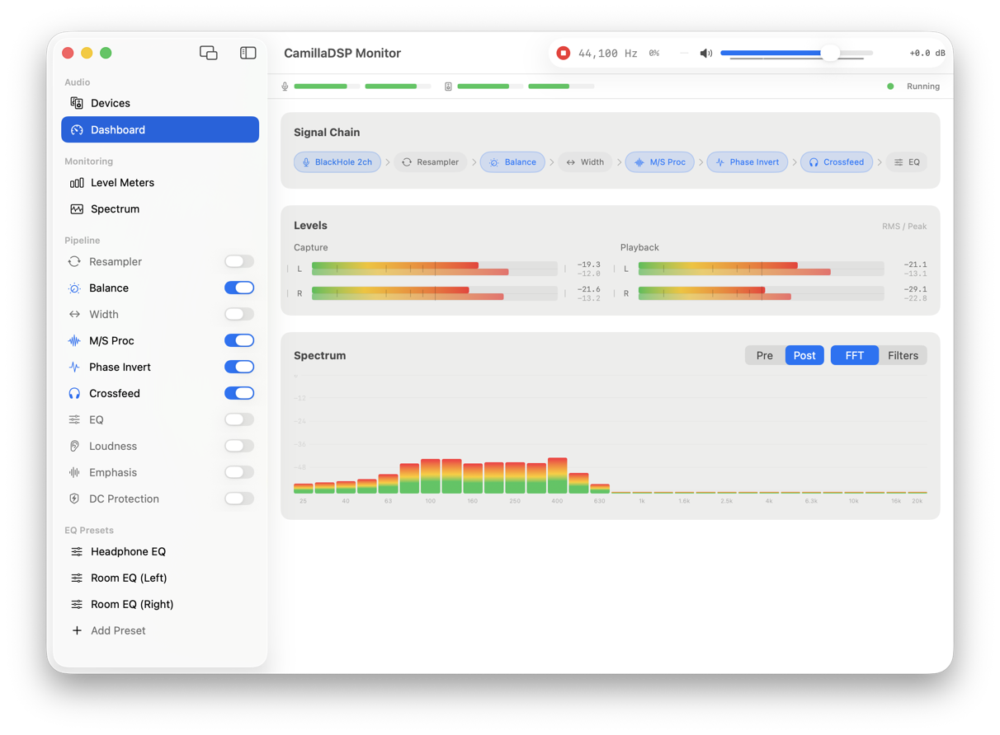
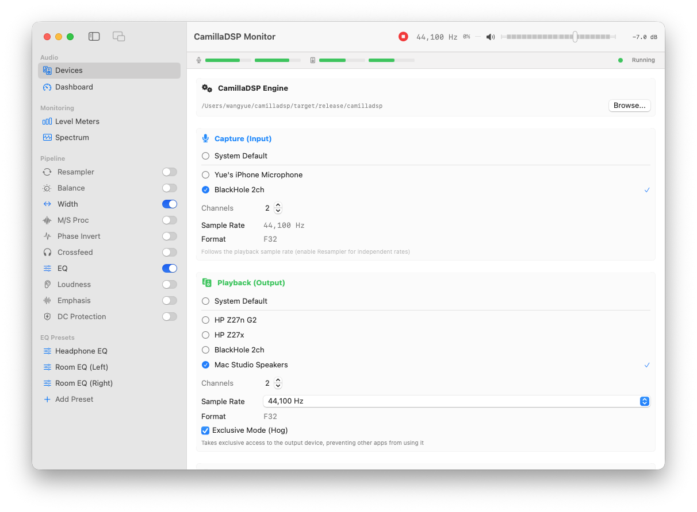
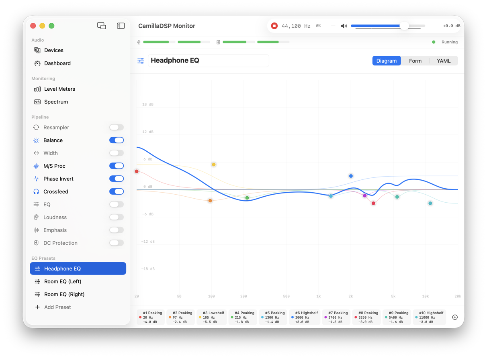

# CamillaDSP Monitor

A native macOS SwiftUI app for controlling and monitoring [CamillaDSP](https://github.com/HEnquist/camilladsp) — a flexible, real-time audio DSP engine for crossovers, room correction, and general audio filtering.

The app connects to a CamillaDSP process via WebSocket, providing real-time level meters, spectrum analysis, device selection, and a full pipeline configuration UI.

## Screenshots





## Requirements

- macOS 14+ (Sonoma)
- Swift 6.0+
- A [CamillaDSP](https://github.com/HEnquist/camilladsp) binary (the app launches and manages the process automatically)

## Building

```bash
swift build
swift run CamillaDSPMonitor
```

The app automatically looks for the CamillaDSP binary in common locations (like `~/camilladsp/target/release/camilladsp`). You can also manually select a custom path in the **Device Settings** screen, which will be saved for future launches.

## Features

### Audio Device Management
- Capture and playback device selection with system default option
- Per-device sample rate picker with hardware rate change detection
- Configurable channel count and chunk size
- Exclusive (hog) mode for output devices
- Auto-refresh on device connect/disconnect

### Monitoring
- **Level meters** — Dual RMS/Peak bars for capture and playback (L/R) with dB readouts
- **Spectrum analyzer** — 30-band 1/3-octave FFT display via independent CoreAudio tap
- **Processing load** — Real-time CPU usage in the toolbar
- **Compact level bar** — Always-visible status strip across all detail views

### Pipeline Configuration

Drag-to-reorder processing stages, each with a dedicated settings panel:

| Stage | Description |
|-------|-------------|
| Balance | L/R pan with linear pan law |
| Width | Stereo width (-100% swapped to 200% extra-wide) via Mid/Side matrix |
| M/S Proc | Mid-Side encoding at -6.02 dB |
| Phase Invert | Left / Right / Both channel polarity flip |
| Crossfeed | 5 presets (L1-L5) or custom Fc/dB with computed filter parameters |
| EQ | Same L/R or Separate L/R mode with preset selection |
| Loudness | Fletcher-Munson compensation with adjustable reference and boost |
| Emphasis | De-emphasis / Pre-emphasis highshelf filter |
| DC Protection | First-order highpass at 7 Hz |

### EQ Preset Editor

Three editing modes for parametric EQ presets:

- **Diagram** — Interactive frequency response graph with draggable color-coded band handles
- **Form** — Table-based editor with type picker, frequency, gain, and Q fields
- **CSV** — AutoEq / EqualizerAPO compatible text format with import/export

Supports 13 biquad filter types: Peaking, Lowshelf, Highshelf, Lowpass, Highpass, Notch, Bandpass, Allpass, and first-order variants.

### Resampler

Dedicated configuration panel for sample rate conversion between capture and playback devices:

- AsyncSinc with quality profiles (Very Fast / Fast / Balanced / Accurate)
- AsyncPoly with cubic interpolation
- Synchronous (fixed ratio)

### Mini Player

Floating translucent overlay (via toolbar PiP button) visible above all windows including fullscreen video. Three display modes: spectrum, pipeline chips, and level meters.

### Engine Control

- Auto-start on launch with soft volume ramp (-30 dB to target)
- Start/Stop toggle in the toolbar
- Auto-recovery when CamillaDSP stalls (e.g., capture format change)
- Connection retry loop on startup (waits for CamillaDSP to be ready)
- Graceful shutdown on app termination

### Persistence

All settings saved to UserDefaults across launches: device selection, sample rates, channel counts, pipeline stage state, EQ presets, volume, and mute state.

## Architecture

```
CamillaDSPMonitor (SwiftUI)
    |
    |-- AppState (@MainActor, ObservableObject)
    |       |-- DSPEngine (actor) ---- WebSocket ----> camilladsp process
    |       |-- CoreAudioTap (AVAudioEngine input tap for FFT)
    |       |-- FFTSpectrumAnalyzer (Accelerate vDSP, background queue)
    |       |-- MeterState (ObservableObject, drives UI)
    |       |-- PipelineStage[] (ObservableObject per stage)
    |       `-- EQPreset[] (ObservableObject per preset)
    |
    `-- Views (NavigationSplitView)
            |-- Dashboard (signal chain + meters + spectrum)
            |-- DevicePicker (capture/playback selection)
            |-- StageDetail (per-stage config UI)
            |-- EQPresetDetail (diagram/form/CSV modes)
            `-- MiniPlayer (NSPanel floating overlay)
```

The `DSPEngine` is a Swift actor that serializes all WebSocket communication. It manages the CamillaDSP process lifecycle (launch, connect, stop) and exposes async methods for commands like `SetConfigJson`, `GetSignalLevels`, and `SetVolume`.

The spectrum analyzer runs independently from CamillaDSP's signal path — it taps the capture device directly via `AVAudioEngine` and performs FFT on a background dispatch queue.

## Project Structure

```
Sources/
  CamillaDSPLib/
    CamillaDSP.swift            # DSPEngine actor, WebSocket protocol, data types
  CamillaDSPMonitor/
    CamillaDSPMonitorApp.swift  # @main app entry, AppDelegate
    Models/
      AppState.swift            # Central state, preferences, properties
      AppState+Engine.swift     # Engine control, config building, soft ramp
      AppState+Devices.swift    # Device enumeration, CoreAudio listeners
      AppState+Monitoring.swift # Polling, FFT analyzer, CoreAudio tap, MeterState
      AppState+Pipeline.swift   # Pipeline persistence
      PipelineStage.swift       # Stage types, enums, active state
      PipelineStage+Builders.swift  # CamillaDSP config dict generation
      PipelineStage+Crossfeed.swift # Crossfeed filter computation
      PipelineStage+Defaults.swift  # Factory defaults, snapshot persistence
      EQPreset.swift            # EQ band/preset models, biquad response, CSV
      EQPreset+Persistence.swift    # Preset CRUD and defaults
      DSPUtils.swift            # BiquadCoefficients (Peaking, Lowshelf, Highshelf)
      CoreAudioTap.swift        # AVAudioEngine input tap, device lookup
    Views/
      ContentView.swift         # NavigationSplitView, sidebar, detail routing
      DashboardView.swift       # Signal chain overview + meters + spectrum cards
      DevicePickerView.swift    # Device/sample rate/chunk size selection
      StageDetailView.swift     # Per-stage config (balance, width, crossfeed, etc.)
      EQPresetDetailView.swift  # Tabbed EQ editor (diagram/form/CSV)
      EQDiagramMode.swift       # Interactive frequency response graph
      EQFormMode.swift          # Table-based band editor
      EQCSVMode.swift           # AutoEq/EqualizerAPO text editor
      LevelMeterView.swift      # Dual RMS/Peak meters, compact bars
      SpectrumView.swift        # 30-band gradient bar spectrum display
      VolumeControlView.swift   # Toolbar volume slider + mute button
      MiniPlayerView.swift      # Floating overlay with mode switcher
      MiniPlayerContent.swift   # Mini spectrum, pipeline chips, meters
      MiniPlayerWindowController.swift  # NSPanel lifecycle
      SettingsView.swift        # App preferences
```

## Dependencies

No external dependencies. Uses only Apple system frameworks:

- **SwiftUI** — UI
- **CoreAudio** — Device enumeration and hardware listeners
- **AVFoundation** — Audio engine tap for spectrum analysis
- **Accelerate** — vDSP FFT for spectrum analyzer
- **Foundation** — WebSocket (URLSessionWebSocketTask), JSON, process management

## Acknowledgments

- [CamillaDSP](https://github.com/HEnquist/camilladsp) by Henrik Enquist
- [CamillaDSP-Monitor](https://github.com/Wang-Yue/CamillaDSP-Monitor) by Wang Yue — inspiration for the monitor UI
- [camilladsp-crossfeed](https://github.com/Wang-Yue/camilladsp-crossfeed/) — crossfeed parameter computation
- Audio EQ Cookbook by Robert Bristow-Johnson — biquad coefficient formulas

## License

See [LICENSE](LICENSE).
