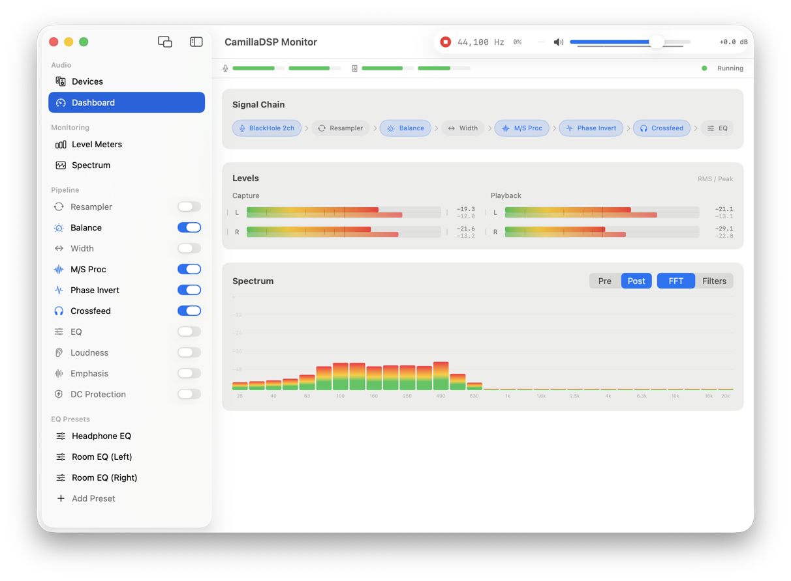
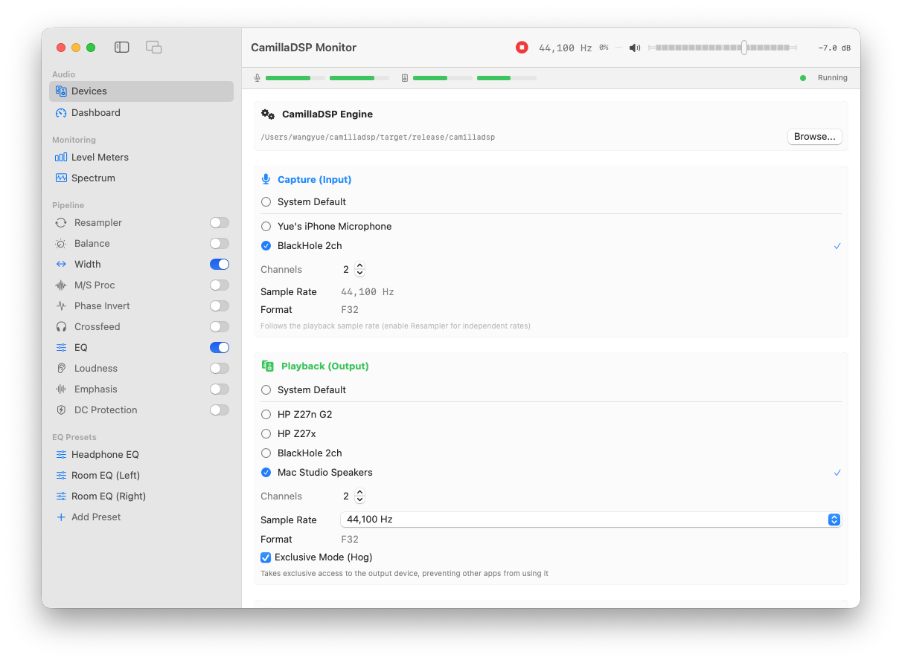
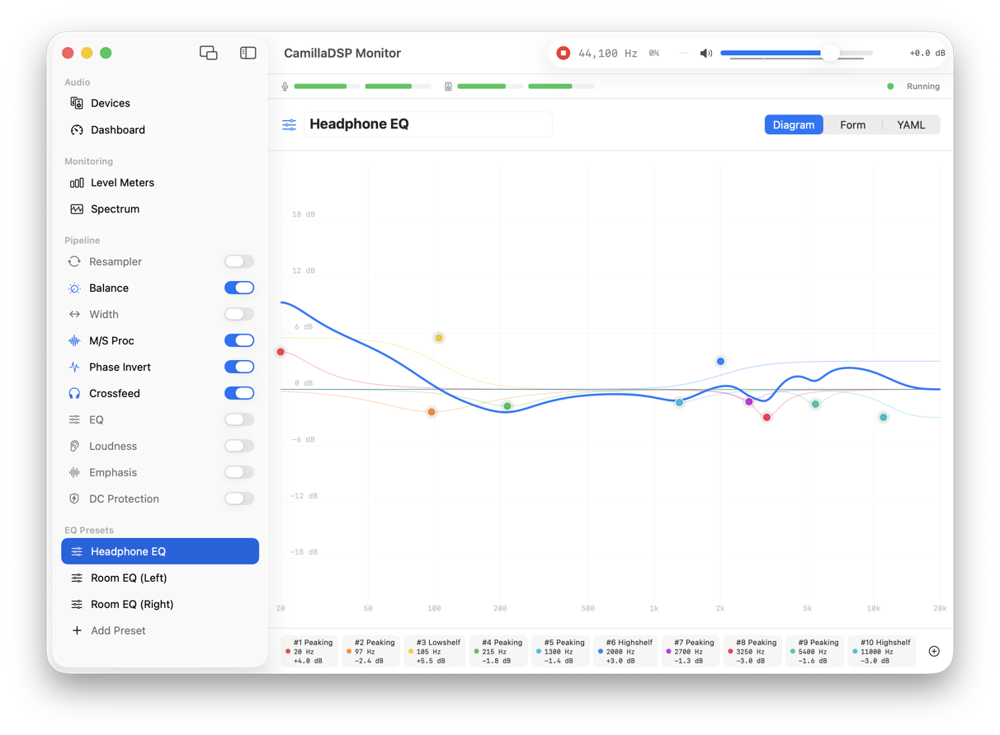

# DSPMonitor

A beautiful, high-performance native macOS app and real-time DSP engine suite designed to control and monitor your digital signal processing workflow. It brings professional-grade audio processing features to your desktop with an intuitive interface, hyper-realistic visualizations, and a highly optimized architecture.

---

## Screenshots





---

## Core Features (macOS Application UI)

DSPMonitor empowers you to take full control of your audio experience with a suite of professional-grade DSP and room correction features:

### 1. Visualize Your Sound
- **Hyper-Realistic VU Meters**: RMS and Peak needles with calibrated scales and warm amber illumination.
- **Precision Spectrum Analyzer**: Real-time FFT visualization across the human audible range (20 Hz to 20 kHz).
- **Spectrogram (Waterfall)**: Time-frequency history plot to easily identify resonances and sustained peaks.
- **Vector Scope (Goniometer)**: Phase relationships and stereo image projection.

### 2. Equalization & Dynamics
- **Visual EQ Editor**: Multi-band EQ editor. Adjust nodes by dragging handles directly on the graph.
- **Oratory1990 Presets Picker**: Search and import headphone profiles directly from the official Oratory1990 online database.
- **AutoEq & CSV Presets**: Import and apply presets from AutoEq or EqualizerAPO configurations.
- **Dynamics Compressor**: Adjust threshold, ratio, attack, release, knee, and makeup gain.
- **Noise Gate**: Clean up background noise with gating controls.
- **Limiter & Lookahead Limiter**: Prevent clipping and control transients.
- **Flexible Filter Block Types**: Support for 13 filter types including peaking, shelving, notch, delay, and bandpass/lowpass/highpass options.
- **Graphic EQ**: Standard multi-band slide-adjustable graphic equalizer.
- **Matrix Mixer**: Fully customizable audio channel matrix router and mixer with per-node gains.

### 3. Spatial and Stereo Processing
- **Stereo Width & Balance**: Adjust image width continuously from mono to extra-wide, balance adjustment, or swap channels.
- **Mid/Side Processing**: Encode or decode M/S signals to manipulate stereo presence.
- **RACE (Receiver Active Crosstalk Cancellation)**: Implements 3D audio effects for speaker playback by canceling acoustic crosstalk.
- **Crossfeed**: Custom 5-level headphone crossfeed for speaker-like audio staging.
- **Phase Inversion**: Polarity flipping for left, right, or both channels.

### 4. Acoustic Room Correction Suite
- **Interactive Acoustic Sweep Measurements**: Generate acoustic sine sweeps and capture room response via a microphone. Supports custom mic calibration file loading.
- **Multi-Position Spatial Averaging**: Record response across multiple listening positions and average them to create robust room equalization filters.
- **Visualizations**: Switchable plots for Magnitude Response (logarithmic frequency), Phase Response, Impulse Response, and Group Delay.
- **Waterfall Plot (CSD - Cumulative Spectral Decay)**: Visualize acoustic decay time and room resonances/modal behavior in three dimensions.
- **Auto-EQ Parametric Fit**: Automatically calculate and fit parametric EQ (PEQ) biquad filters to target curves, optimizing frequency, gain, and Q factor.
- **FIR Filter Design**: Invert the impulse response to design finite impulse response (FIR) filters for room phase/magnitude correction.
- **Subwoofer Integration Assistant**: Cross-correlates mains-only and subwoofer-only impulse responses to compute the exact subwoofer delay (for phase alignment) and recommends the optimal crossover frequency and filter configurations.

### 5. Signal Recovery & Safety
- **Fletcher-Munson Loudness**: Smooth loudness compensation adjusting bass/treble boost relative to target volume.
- **CD Pre-Emphasis De-Emphasis**: Restores correct high-frequency response for old pre-emphasized CD masters.
- **DC Protection**: Zero-latency high-pass filter at 7 Hz to safeguard drivers.

### 6. Device & Engine Management
- **Audio Device Picker**: Easy routing control with detailed capability querying (sample rates, channel counts, and sample format layouts).
- **Resampler configuration**: Fine-tune resampling modes (Synchronous, Async Poly, Async Sinc) with detail settings for filter length, interpolation order, and transition bandwidth.
- **Console logs viewer**: Inspect live server/engine log output in real-time, filtered by log level (trace, debug, info, warn, error).
- **Mini Player Mode**: Keep an eye on VU levels or spectrum graphs in a translucent, floating overlay that stays above all active windows.

---

## Requirements

- **macOS 15+ (Sequoia)** (App UI & Accelerate framework features)
- **Swift 6.0+** (Strict Concurrency enabled)
- **Optional**: Rust toolchain (Cargo) — only required if building with `ENGINE=rust`.
- **Optional (C Engine)**: `clang` or `gcc` compiler.

---

## Building & Installation

Use the main `Makefile` to control build targets. You can choose the engine at build time using the `ENGINE` variable (defaults to `swift`).

### 1. Build and Run macOS Application Bundle
To build the macOS native UI application:
```bash
make                          # Build DSPMonitor.app (Default Engine: swift)
make ENGINE=c                 # Build DSPMonitor.app (Engine: CDSP C engine)
make ENGINE=rust              # Build DSPMonitor.app (Engine: Rust CamillaDSP)
```
- Use `make install` to copy the built app bundle into `/Applications/`.
- Use `make run` to build and immediately open the app.

### 2. Standalone Command-Line Tool (`dsp-cli`)
You can build a standalone command-line tool as a drop-in replacement for the CamillaDSP command-line interface:
```bash
make cli                      # Builds Swift dsp-cli executable
make ENGINE=c cli             # Builds C dsp-cli executable
```
*Outputs:*
- Swift CLI: `.build/release/dsp-cli`
- C CLI: `Sources/CDSP/bin/dsp-cli`

### Other Make Commands
```bash
make build                    # Compiles without packaging the app bundle
make test                     # Runs full test suite (Swift or C depending on ENGINE)
make bench                    # Runs benchmarks (Swift or C depending on ENGINE)
make clean                    # Removes all build artifacts
```

---

## Command Line Usage (`dsp-cli`)

The compiled `dsp-cli` supports the standard CamillaDSP control schema and can be configured as follows:

```bash
dsp-cli [CONFIGFILE] [OPTIONS]
```

### Options:
- `-c, --check`       Check config file and exit.
- `-s, --statefile`   Use the given file to persist volume/mute state.
- `-w, --wait`        Wait for configuration from WebSocket (starts inactive).
- `--no_config`       Ignore config file in statefile and start without.
- `-p, --port`        Port for the WebSocket control server.
- `-a, --address`     IP address to bind WebSocket server to (defaults to `127.0.0.1`).
- `-l, --loglevel`    Log level (`trace`, `debug`, `info`, `warn`, `error`).
- `-o, --logfile`     Write logs to the given file path.
- `-g, --gain`        Initial gain in dB for the main volume control.
- `--gain1` to `4`     Initial gain in dB for Aux1, Aux2, Aux3, Aux4 faders.
- `-m, --mute`        Start with main volume control muted.
- `--mute1` to `4`     Start with Aux1, Aux2, Aux3, Aux4 faders muted.
- `-r, --samplerate`  Override sample rate in config.
- `-n, --channels`    Override number of capture device channels in config.
- `-f, --format`      Override sample format of capture device in config.

### Supported Backends:
- **Capture**: CoreAudio, ALSA, Pulse, PipeWire, JACK, Bluez, WASAPI, ASIO, File, Stdin, Generator
- **Playback**: CoreAudio, ALSA, Pulse, PipeWire, JACK, WASAPI, ASIO, File, Stdout

---

## Technical Highlights

For an in-depth exploration of the core real-time processing design, thread synchronization, off-thread garbage collection, and benchmark evaluations, please refer to the complete [ARCHITECTURE.md](ARCHITECTURE.md) document.

### 1. Wait-Free Concurrency & Real-Time Safety
To satisfy sub-millisecond real-time deadlines, the audio hot paths (Capture, Processing, Playback loops) achieve **zero lock contention** and **zero heap allocations/deallocations**:
- **Lock-Free Ring Buffers**: Uses custom single-producer single-consumer (SPSC) queues with atomic indices using acquire-release memory ordering.
- **Platform Semaphores**: Leverages platform-native binary semaphores (`dispatch_semaphore` on macOS, POSIX semaphores on Linux) for low-overhead thread wakeup and sleeping instead of heavy mutexes.
- **Deferred Garbage Collection**: Configuration updates and WAV coefficient loads are compiled in the background by the control thread. An atomic swap passes the pipeline to the processing thread, which copies the active history states (biquads, loudness, volume) in-place without pausing the audio. The old structures are sent to a background garbage queue to be freed off the audio thread.

### 2. Native Acceleration & Vectorization
- **Apple Accelerate**: Biquad calculations, mixer mappings, and FFTs utilize macOS **Accelerate (vDSP / vForce)** kernels, optimized for Apple Silicon ARM NEON units.
- **Dynamic GCD Scheduling**: Parallelizes multi-channel filtering using Grand Central Dispatch (`concurrentPerform`), dynamically steering lanes to Performance (P) and Efficiency (E) cores according to cache locality and thread priority.
- **NEON Register Pinning**: Windowed-sinc and polynomial resamplers enforce SIMD register residency in vector loops using `SIMD2<Double>` with 8 independent accumulators, preventing compiler scalarization.

### 3. Integrated Format & Fail-Safe Features
- **DoP (DSD over PCM) Support**: Fully integrated in-place decoding (at capture loop) and encoding (at processing loop) of DSD256 carrier streams, allowing downstream DSP stages to work on standard decimated PCM.
- **Stall Watchdog**: Unified engine-level capture watchdog that detects device drops, clock drift, and hangs across ALSA, CoreAudio, and other backends, rather than repeating driver-specific watchdog code.

---

## Acknowledgments

- [CamillaDSP](https://github.com/HEnquist/camilladsp) by Henrik Enquist - for the WebSocket API and configuration schema layout.
- Audio EQ Cookbook by Robert Bristow-Johnson - for standard biquad coefficient equations.

## License

Distributed under a custom permissive license. See [LICENSE](LICENSE) for details.
