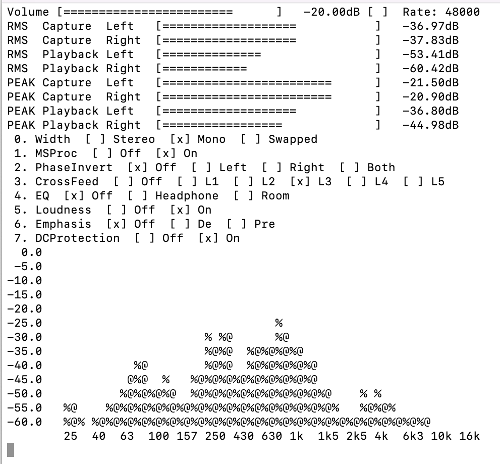

# CamillaDSP Monitor

A host monitor program for CamillaDSP.

# Introduction

The [CamillaDSP](https://github.com/HEnquist/camilladsp/) project provides a seamless approach to do DSP system-wide on all major desktop operating systems, with various DSP features ready to be used, such as [Loudness](https://en.wikipedia.org/wiki/Loudness_compensation), [Convolution](https://en.wikipedia.org/wiki/Convolution), or [Parametric EQ](https://en.wikipedia.org/wiki/Equalization_(audio)#Parametric_equalizer). 

The program utilizes a setting file that can be sent to the [websocket](https://henquist.github.io/0.6.3/websocket.html) in run time. To make the setting adjustable, there are programs such as [CamillaGUI](https://github.com/HEnquist/camillagui) that allow run time edit of the parameters and pipeline. Those programs are very helpful, and greatly simplify the workflow for various tasks. Unfortunately, there're certain drawbacks of these programs, mainly in the following perspectives:

1. The GUI program has no way to disable/enable a set of filters/mixers in runtime. Some EQ functions, such as room correction or headphone EQ, require a set filters to be enabled or disabled at the same time. Other functions, such as headphone crossfeed, needs a few filters in combination with a few mixers to work together. Neither GUI nor the setting file has the concept of "functional blocks" that allows a group of filters/mixers to work together.

2. The changes to the parameters are not reflected in the DSP immediately. One has to save and apply the settings so see its effect. This is a cumbersome process.

3. There's no automatic error handling in the GUI program. For instance, when the sample rate of the input device changes, CamillaDSP will pause and need another control program to correct itself. the GUI program does not provide this feature.

That's why I build this short script to address the above issues. The script is by no means a mature software product. It's just for me to access to some DSP workflow I usually performs. It's super hacky and may crash when you're holding it wrong.

# DSPs available

The DSP workflow is heavily inspired by the [RME ADI-2 DAC](https://www.rme-audio.de/adi-2-dac.html). It offers the following functionalities, and more can be added in the same way.

## Volume Control

You can control the output volume by arrow keys. Left and right adjust volume by 10dB, while up and down adjust it by 1dB.

## Status Monitor

The current sample rate, RMS and peak volume of both input and output channels are clearly displayed on the terminal

## Phase Inversion

Some poorly mastered recordings have inverted phase and the script can correct it.

## EQ

The script provides EQ function for headphone and room correction.

## Crossfeed

The script offers 5 levels of headphone crossfeed based on my [CamillaDSP-Crossfeed](https://github.com/Wang-Yue/camilladsp-crossfeed/) project.

## Loudness

The script offers the same Loudness feature as the RME ADI-2 DAC.

# User Interface

The script has a simple terminal user interface. When being executed, CamillaDSP is started automatically.

## Control

You can control the output volume by arrow keys. Left and right adjust volume by 10dB, while up and down adjust it by 1dB.

You can enable/disable DSP features by number keys. For instance press `31` turn on the loudness feature, and `30` to turn it off.

You can quit the program and CamillaDSP by pressing `q`. 

## Spectrum analyzer

The Analyzer is modeled after RME’s ADI-2 DAC, which is based on Spectral Analyzer in DIGICheck. 

It uses 29 biquad bandpass filters for high separation between the bands, providing outstanding musical visualization.
To be able to also show DC content the lowest band is not a band-pass filter, but a low pass, catching the whole range
from 0 Hz up to 30 Hz. With some unusual signals it therefore can happen that the level shown will be a bit higher than expected.

The shown frequency range is always the human audible range, 20 Hz up to 20 kHz.

As opposed to most other solutions no FFT (Fast Fourier Transform) is used. The Spectral
Analyzer performs a true band-pass filter calculation, as in professional hardware devices. The
frequency distance between the filters is scaled matching human hearing. 

The Spectrum Analyzer shows spectrum for both left and right channels. `%` symbol indicates level for the left channel and `@` for the right channel.

## Parameter Tuning

You can open a text editor and tune parameters in `setting.yml`. The script automatically checks if the file is changed, and will reflect your changes immediately in the DSP. 

## Automatic Sample Rate Switching

The script will automatically restart the DSP program when it pauses due to sample rate changes.

# Special Thanks

Many thanks to @HEnquist for the wonderful CamillaDSP program, and to RME for creating the mighty ADI-2 DAC that inspred this script.
